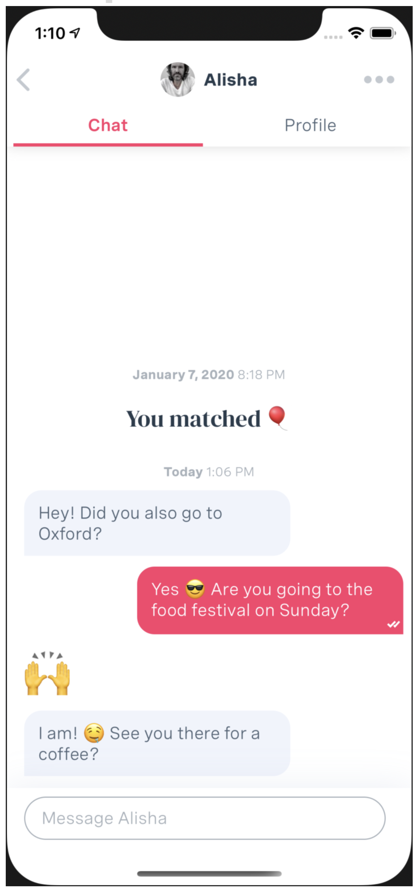

#  Chat-like take home project

## Description
In this exercise you are expected to create a chat interface similar to that found in the Muzz app. You may complete this task with SwiftUI or UIKit. Both are in use at Muzz and both are valued highly. Please do not use MessageKit or a similar framework, we’re looking to see how you go about solving the problem.

## Requirements
* Chat UIs page in the opposite direction as traditional list views with older
messages shown when reaching the top of the scroll view not the bottom.
* As you enter text into the input and tap send your message should be added
to the messages
* Distinguish between received and sent messages by aligning them left or right
respectively.
* The messages should be encased in a “bubble” as per Screenshot 1.
* Messages should be grouped using the following logic:
  * Messages separated by more than an hour should show sectioned with the date and time (format “{day} {timestamp}”).
  * Messages from the same user sent within 20s of each other should have a smaller vertical spacing between them. Making them look grouped together.
* Message persistence with Realm or CoreData or SwiftData

## Animation
The text entered into the input should animate into the message list akin to Apple’s Messages app. [This video makes this clearer](https://youtu.be/WkYdn5Yt1Dg). The animation does not need to be perfect but the logic in place showing an animation into the message list.

## Nice to have
MVVM or equivalent SwiftUI code structure
RxSwift or Combine

# Summary

## Total Time Spent on the Project
I estimate that the total time spent on the project is between 18-22 hours.

## iOS Target Version & Supported Devices
I chose iOS 15 as the target version because it meets Muzz's minimum requirement. The app supports iPhones and iPads in portrait mode, similar to the Muzz app.

## Dependency Management
I chose CocoaPods as the dependency manager for the project. The Pods I selected align with the project requirements, which include:
* Realm (RealmSwift) for data storage.
* RxSwift (+RxCocoa) for data and control binding.
* Additionally, Kingfisher for quick asynchronous remote image downloading.

## Extras
In addition to the required Chat screen, I decided to implement some additional components and functionalities such as:
* Chat List Screen: This screen demonstrates how navigation can be handled using simple coordinators (MVVM-C) and illustrates how SwiftUI and UIViewControllers can coexist within a single module. It also showcases aspects of protocol-oriented programming, as well as factory or dependency patterns, without relying on any external
libraries.
* Localization: I localized the application to Arabic, allowing you to test it by running one of the two created shared schemes. The translations were prepared with the help of ChatGPT, and this feature demonstrates how the app's layout changes between LTR and RTL modes.
* Preloaded Users and Messages: I implemented preloaded users and messages, along with simulated responses in the chat. When a new message is sent, a mocked socket service first simulates the delivery of the message, followed by the message being marked as read. Additionally, there is a certain probability of automated follow-up responses being dropped once the message is read.
* Extensions Organization - I decided to place all extensions in a single Extensions.swift file, as opposed to creating separate files for each class or struct being extended, to maintain simplicity and organization within the project structure.

## What Could Be Improved
* Tests: I added a few examples of XCTests to the project, but in an actual project, there would likely be more. Since the app doesn't perform any time-consuming processes, there was no need to implement "expectation/fulfillment" tests.
* Error Handling: Due to limited time resources, I couldn't implement full-scale error handling. As a result, you can find some parts where I force try Realm operations. However, I at least added a check to ensure that Realm is set up correctly when the app starts.

## Result
[Arabic version](https://github.com/interviewee92/MuzzChat/blob/main/arabic.mp4)

[English version](https://github.com/interviewee92/MuzzChat/blob/main/english.mp4)
